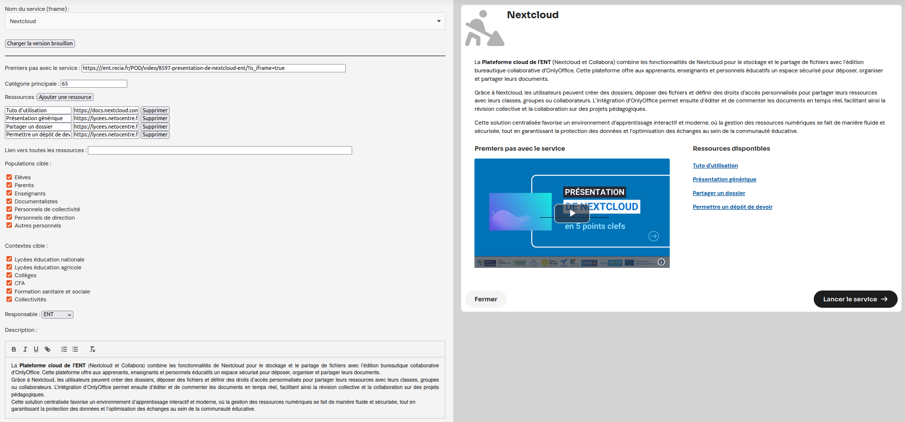

# Fonctionnement

## Prérequis

- Un uPortal avec accès en lecture à la base de données (table `PORTLET_FNAME`) ;
- Un dossier qui va contenir un ensemble de fichiers JSON correspondant aux différentes fiches infos ;
- Un fichier CSV qui va contenir les catégories principales associées aux services (fnames) ;
- Un fichier CSV qui va contenir les fnames des services "nouveaux" ;
- Un serveur CAS pour l'authentification sur la partie création/édition de fiche info.

## Routes

Voir le [README.md](../README.md)

## Cache

Le service dispose de 3 caches :
- service-info : Garde en cache les fiches infos pour chaque service
- service-list : Garde en cache le résultat de la requête de liste de tous les fnames en BDD
- service-all : Garde en cache le résultat de la requête de résumé de tous les services

Par défaut les 3 caches ont une durée de vie d'une heure. Les caches `service-info` et `service-all` sont automatiquement actualisés lorsqu'une nouvelle fiche info est ajoutée.
Pour l'ajout d'un nouveau service, il faut soit attendre que le cache `service-list` se vide, soit redémarrer l'applicatif pour le voir dans l'interface de gestion des fiches infos.

## Versions

Il y a une notion de version pour les fiches infos :
- Une version brouillon qui permet de sauvegarder des modifications sans avoir à les pousser en production ;
- Une version production qui permet de pousser les fiches infos en production.

Chaque version stocke les fichiers JSON dans un dossier différent.

## Interface d'admin

L'interface de gestion des fiches infos est accessible via `service-info-api/create` et protégée par authentification CAS (attention à bien limiter les accès au niveau de la définition de service CAS).

L'interface dispose d'une prévisualisation du rendu final qui s'actualise en temps réél à droite et une edition de la fiche info à gauche, qui contient les champs suivants :
- Premiers pas avec le service : lien vers une vidéo de présentation du service
- Catégorie principale : en lecture seule, à définir via un fichier CSV (id de la catégorie)
- Ressources : liste de titres et de liens vers des ressources
- Populations cible : pas utilisé pour l'instant
- Contextes cible : pas utilisé pour l'instant
- Responsable : pas utilisé pour l'instant
- Description : une description du service (via un éditeur wysiwyg)
- En haut de l'interafce il y a un bouton qui permet de changer entre version brouillon et version production
- En bas de l'interface il y a 2 boutons qui permettent de sauvegarde la fiche info dans la version voulue
